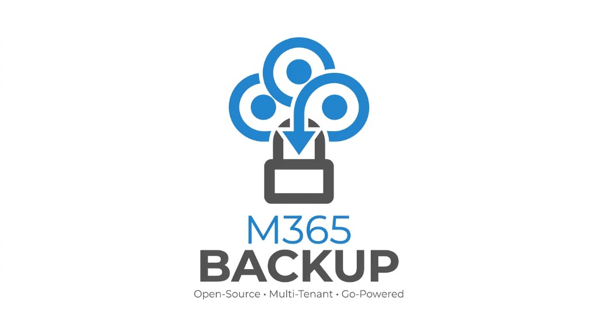
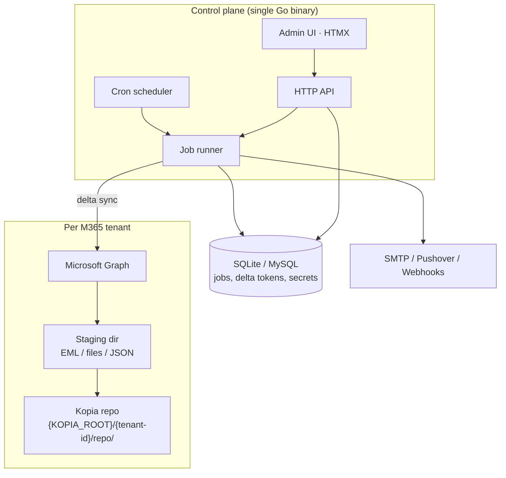

# M365 Backup

<p align="center">
  
</p>

**Open-source multi-tenant Microsoft 365 backup** for self-hosted / data-center operation.

Single Go binary · Graph API delta sync · encrypted snapshots · HTMX admin UI · Apache 2.0

[](LICENSE)
[](https://go.dev/)

---

## Why

After MinIO Community Edition was archived and Corso moved fully commercial, there is no strong open-source **multi-tenant** M365 backup stack for operators who want:

- many customer tenants in one control plane
- incremental Graph sync + storage-level dedup/encryption
- restore without a proprietary backend (repo path + password)
- no vendor lock-in

M365 Backup fills that gap.

## Production use case

We run this stack **on our own infrastructure** (data center / private cloud) as the production Microsoft 365 backup for customer tenants: multi-tenant control plane, encrypted snapshot storage on our disks, Graph delta sync, and restore without a SaaS vendor in the path.

Typical deployment: Debian or Docker Compose + MySQL, bind-mounted snapshot/staging volumes, reverse proxy with TLS, env-based secrets (`MASTER_KEY`, `ADMIN_PASSWORD`, Azure app credentials per tenant).

**Community support:** none guaranteed. The project is open source (Apache 2.0) and provided as-is; operators run, secure, and operate it themselves. Issues/PRs may be reviewed best-effort only.

**Not fully tested.** Coverage is incomplete; expect bugs, edge cases, and breaking changes. Validate restores and monitor jobs before relying on it for critical data.

**Commercial support:** if you need help with deployment, operation, or a production SLA, contact [Reiner IT-Systems](https://www.reiner-itsystems.de/) via the website ([Kontakt](https://www.reiner-itsystems.de/kontakt/)).

## Features

- **Multi-tenant** – manage arbitrary Entra ID / Microsoft 365 tenants
- **Services** – Exchange (EML + delta), OneDrive (delta), Teams / SharePoint (full pull; see [Current status](#current-status-kopia--services)), PST EML-ZIP export
- **Incremental** – Graph delta tokens in SQLite or MySQL + encrypted **Kopia** repo per tenant (live `sync/` for Exchange/OneDrive)
- **Scheduler** – cron expressions per tenant/service (`robfig/cron`)
- **Retention** – Smart Recycle (hours/daily/weekly/monthly/yearly) + Kopia GC
- **Notifications** – SMTP, Pushover, Slack/Teams/generic webhooks (errors, key expiry, restore)
- **Key monitoring** – alert when Azure client secrets approach expiry
- **Admin UI** – HTMX + Go templates embedded in the binary (tenant tabs, live jobs, browser)
- **Direct restore** – ZIP export; Graph upload for OneDrive/SharePoint
- **Docker** – `docker compose` with MySQL and bind-mounted data paths

## Architecture



**Data flow:** Scheduler (or UI) enqueues a job → runner pulls changes via Graph delta → writes into a staging directory → creates a [Kopia](https://kopia.io/) snapshot in that tenant’s repo → updates delta tokens in the DB → optional notification.

**Storage:** real Kopia Go library (`github.com/kopia/kopia`). Per tenant: `{KOPIA_ROOT}/{tenant-id}/repo/` (encrypted content-addressable store) plus sibling `sync/` / `exports/` for live trees and PST runs.

**Smart Recycle:** after each backup, Synology-style retention runs **per service** (hours/daily/weekly/monthly/yearly + keep-min). Expired Kopia snapshot manifests are deleted, then full Kopia maintenance/GC reclaims blob space.

**Disaster recovery without this app:** NOT TESTED YET! keep each tenant’s repository password offline. Full CLI steps: [Restore with Kopia CLI](#restore-with-kopia-cli).

## Current status (Kopia & services)

Honest snapshot of what works today vs. what is still thin. Treat this as early/open-source software: validate restores before trusting it with critical data.

### Kopia

| Topic | Status |
|-------|--------|
| Engine | Real [Kopia](https://kopia.io/) Go library (`github.com/kopia/kopia`) — not a custom tar format |
| Layout | Per tenant under `{KOPIA_ROOT}/{tenant-id}/`: `repo/` (encrypted content-addressable store), sibling `sync/` (live trees), `exports/` (PST runs) |
| Snapshots | Created after each successful backup job; tagged with service (`m365-service` / username = service) |
| Retention | **Smart Recycle** (Synology-style) per service: keep hours → daily → weekly → monthly → yearly + keep-min; then Kopia maintenance/GC |
| Defaults | 24h / 7d / 4w / 6m / 2y / min 3 snapshots; last 5 PST export runs |
| Offline restore | Works with stock `kopia` CLI if you have **repo path + tenant repo password** (export once via UI; not the `MASTER_KEY`) |
| Backends | **Filesystem only** today — no S3 / RustFS / offsite replication yet |
| UI password export | After tenant create + Tenant → Einstellungen → **Offline-Recovery** (re-enter admin password → reveal / `.txt` download) |

**Disk note:** Exchange and OneDrive keep a full **live sync tree** *and* Kopia snapshots of that tree. Plan capacity for both.

### Per-service maturity

| Service | Sync model | Snapshot | Restore | Notes |
|---------|------------|----------|---------|-------|
| **Exchange** | Incremental Graph **delta** into persistent `sync/exchange/` (`.eml`) | Yes — Kopia of sync tree | ZIP of EMLs | Shared mailboxes supported; first sync can be heavy |
| **OneDrive** | Incremental drive **delta** into `sync/onedrive/` | Yes | ZIP or Graph upload → `M365Backup-Restore/` | Solid incremental path |
| **Teams** | Full pull into **staging** each run (no real delta) | Yes | ZIP only | Channel messages as `messages.json` + `messages.html`; **attachments not downloaded**; 1:1/group chats not backed up yet |
| **SharePoint** | Staging each run; **root drive children only** | Yes | ZIP or Graph upload | No deep recursion / real delta yet |
| **PST export** | Reads Exchange live sync → `exports/pst/{run}/` | **No** Kopia snapshot (`SkipSnapshot`) | Download ZIPs from UI | ZIP of EML trees — **not** binary Outlook `.pst` (no OSS writer yet) |

Default schedules (after consent): Exchange hourly · OneDrive nightly · Teams nightly · SharePoint weekly · PST weekly but **disabled**.

### Admin UI / ops (working)

- Multi-tenant onboarding + admin consent flow
- Tenant page: quick actions (start backup) + tabs (Jobs, Settings, Statistics, Snapshots, PST exports)
- Job runner with live progress, cancel, logs
- Dateibrowser (service + snapshot version), ZIP restore, OD/SP Graph restore
- Offline Kopia recovery export (repo password reveal / `.txt` download)
- Notifications: SMTP, Pushover, Slack/Teams/generic webhooks
- Client-secret expiry alerts (warn only — no auto-rotation)
- Disk usage cache (`tenant_usage`, hourly + manual refresh)
- OpenAPI / Swagger at `/openapi`
- Deploy: Docker Compose (MySQL 8.4) or systemd + SQLite/MySQL

### Known gaps

- Calendar / Contacts — permissions documented, **no jobs** yet
- Teams attachments + chats; SharePoint depth/delta
- Binary `.pst` writer
- Offsite / S3 Kopia backend; RBAC, audit log, 2FA, Vault
- Limited automated tests — Graph edge cases and multi-tenant load are under-covered
- Single shared `ADMIN_PASSWORD` (no per-operator accounts)

See [Roadmap](#roadmap) for planned work.


## Requirements

- Go 1.22+ (build) or a released binary
- Linux recommended (Debian 12/13 for production)
- Disk for snapshot repos (e.g. `/var/lib/m365backup` or Apollo mount)
- Azure app registration **per tenant** with application permissions (see below)
- Optional: Docker + MySQL 8.4 via Compose

## Quick start

```bash
git clone <repo-url> m365backup
cd m365backup
cp .env.example .env

# Generate a 32-byte master key (base64) — keep this offline as well
openssl rand -base64 32
# Put the value in .env as MASTER_KEY=...
# Set ADMIN_PASSWORD to a strong password (8+ chars)

go run ./cmd/server
```

Open http://localhost:8080 and sign in with `ADMIN_PASSWORD`.

**Never commit `.env`.** Only `.env.example` (placeholders) belongs in git.

## Docker Compose (MySQL)

Preferred for a quick deploy: app + **MySQL 8.4** (no PostgreSQL). Point host directories at your disks and start.

```bash
cp .env.example .env
# Edit .env — at minimum:
#   MASTER_KEY=$(openssl rand -base64 32)
#   ADMIN_PASSWORD=...
#   MYSQL_PASSWORD=...
#   MYSQL_ROOT_PASSWORD=...
#   DATA_KOPIA_PATH=/mnt/apollo/m365/kopia
#   DATA_STAGING_PATH=/mnt/apollo/m365/staging
#   MYSQL_DATA_PATH=/mnt/apollo/m365/mysql
#   PUBLIC_BASE_URL=https://backup.example.com
#   DB_DRIVER is forced to mysql inside compose

docker compose up -d --build
```

| Env var | Purpose | Default |
|---------|---------|---------|
| `DATA_KOPIA_PATH` | Host path for snapshot repos | `./data/kopia` |
| `DATA_STAGING_PATH` | Host path for job staging | `./data/staging` |
| `MYSQL_DATA_PATH` | Host path for MySQL datadir | `./data/mysql` |
| `HTTP_PUBLISH_PORT` | Published HTTP port | `8080` |

MySQL is **not** published to the host; the app reaches it only as hostname `mysql` on the compose network.

Open http://localhost:8080 (or your `PUBLIC_BASE_URL`).

```bash
docker compose logs -f m365backup
docker compose down
```

SQLite remains the default for bare-metal / `go run` without Docker (`DB_DRIVER=sqlite`).

## Installation

### From source

```bash
go build -o m365backup ./cmd/server
sudo install -m 0755 m365backup /opt/m365backup/m365backup
```

### systemd (Debian)

1. Create user and data dirs:

```bash
sudo useradd --system --home /var/lib/m365backup --shell /usr/sbin/nologin m365backup
sudo mkdir -p /opt/m365backup /etc/m365backup /var/lib/m365backup/{kopia,staging}
sudo chown -R m365backup:m365backup /var/lib/m365backup
```

2. Create `/etc/m365backup/m365backup.env` from [`.env.example`](.env.example) with real values (mode `0600`).

3. Install the unit from [`deploy/m365backup.service`](deploy/m365backup.service):

```bash
sudo cp deploy/m365backup.service /etc/systemd/system/
sudo systemctl daemon-reload
sudo systemctl enable --now m365backup
```

### Binary releases

Publish artifacts from CI (GitHub/GitLab Releases) and install the same way as “from source”.

## Configuration

| Variable | Required | Default | Description |
|----------|----------|---------|-------------|
| `HTTP_ADDR` | no | `:8080` | Listen address |
| `PUBLIC_BASE_URL` | no | `http://localhost:8080` | Base URL for Azure consent redirect |
| `DB_DRIVER` | no | `sqlite` | `sqlite` or `mysql` |
| `DATABASE_PATH` | sqlite | `./data/m365backup.db` | SQLite file path |
| `MYSQL_HOST` / `PORT` / `USER` / `PASSWORD` / `DATABASE` | mysql | — | MySQL connection (or set `MYSQL_DSN`) |
| `KOPIA_ROOT` | no | `./data/kopia` | Per-tenant snapshot repos |
| `STAGING_ROOT` | no | `./data/staging` | Temporary backup staging |
| `MASTER_KEY` | **yes** | — | Base64 32-byte AES key |
| `ADMIN_PASSWORD` | **yes** | — | UI password (min 8 chars) |
| `MAX_CONCURRENT_JOBS` | no | `2` | Parallel backup jobs |
| `SMTP_*` | no | — | Optional env-level SMTP fallback |

Secrets must live in environment / `EnvironmentFile=` only — never in the repository.

## Azure setup

Create **one app registration** (in your ops tenant or the customer tenant) and grant **Application** permissions:

| Permission | Purpose |
|------------|---------|
| `Mail.Read` | Exchange mail |
| `Mail.ReadWrite` | Optional restore |
| `Files.Read.All` | OneDrive / SharePoint |
| `Files.ReadWrite.All` | Optional Graph restore |
| `ChannelMessage.Read.All` | Teams channel messages |
| `Team.ReadBasic.All` | List teams (required to enumerate) |
| `Chat.Read.All` | Teams chats |
| `Sites.Read.All` | SharePoint sites |
| `User.Read.All` | Enumerate users |
| `Application.Read.All` | Secret expiry checks |
| `Calendars.Read` / `Contacts.Read` | Optional (not in MVP jobs) |

### Admin consent flow

1. Add tenant in UI (name, Azure tenant ID, client ID, client secret, optional expiry date).
2. Click **Admin consent** — redirects to Microsoft.
3. Customer admin approves → callback sets status `active`.
4. First backup jobs for all four services are enqueued automatically.

Redirect URI to register:

```
https://<your-host>/api/consent/callback
```

## API

After login, open **API** in the admin nav or go to `/openapi` for interactive Swagger UI.
The live OpenAPI 3 document is at `/openapi.yaml` (session required); `servers` is set to this instance’s `PUBLIC_BASE_URL`.

## Storage usage (billing)

Disk usage is measured like `du` over the tenant dir (`repo/` + `sync/` + `exports/`) and **cached in `tenant_usage`**. A cron runs hourly (`:15`), plus a scan ~45s after startup. The tenants list only reads the cache (so login stays fast).

Refresh from the admin UI (**Speicher aktualisieren**) or:

```http
POST /api/tenants/usage/refresh
POST /api/tenants/{id}/usage/refresh
GET  /api/tenants/{id}/usage          # cached
GET  /api/tenants/{id}/usage?fresh=1  # measure now and store
GET  /api/tenants?usage=1             # list with cached usage
```

## Backup & restore

| Service | Backup format | Restore |
|---------|---------------|---------|
| Exchange | `.eml` in live `sync/` → Kopia snapshot | ZIP download |
| OneDrive | Original files in live `sync/` → Kopia | ZIP or Graph upload to `M365Backup-Restore/` |
| SharePoint | Site files + `site.json` (staging) → Kopia | ZIP or Graph upload |
| Teams | `messages.json` + `messages.html` (staging) → Kopia | ZIP archive only |
| PST | EML trees as ZIP under `exports/pst/` (no Kopia snap) | Download from UI — not binary `.pst` |

Via the admin UI: open the tenant → **Snapshots** → browse / ZIP download; OneDrive and SharePoint can also push back into Graph (`M365Backup-Restore/`).

For maturity and limitations per service, see [Current status](#current-status-kopia--services).

### Restore with Kopia CLI

NOT TESTED YET!

Yes — every tenant repo is a **standard [Kopia](https://kopia.io/) filesystem repository**. If this app, the DB, or the control plane is gone, you only need:

1. The on-disk repo: `{KOPIA_ROOT}/{tenant-id}/repo/`
2. That tenant’s **repository password** — **not** `MASTER_KEY`

**Critical:** the repo password is generated at tenant create and stored encrypted in the DB under `MASTER_KEY`. If you never export it, losing the DB (or `MASTER_KEY`) means you **cannot** open the Kopia repo. Export it once and keep it offline.

In the admin UI: after creating a tenant you are redirected to **Offline-Recovery**; later via Tenant → **Einstellungen** → *Recovery-Passwort exportieren*. Re-enter the admin password, then **Anzeigen** or download the `.txt` sheet.

Install the upstream CLI ([kopia.io/docs/installation](https://kopia.io/docs/installation/)), then:

```bash
# 1) Connect (path = .../repo, not the parent tenant folder)
export KOPIA_PASSWORD='<TENANT_REPO_PASSWORD>'   # or let the CLI prompt
kopia repository connect filesystem \
  --path /var/lib/m365backup/kopia/<tenant-id>/repo \
  --readonly

# 2) List snapshots (host is always m365backup; username = service)
kopia snapshot list --all
# Optional filter, e.g. Exchange only:
kopia snapshot list --all --tags m365-service:exchange

# 3a) Restore a whole snapshot to a folder
kopia snapshot restore <snapshot-id> /restore/target

# 3b) Or mount and copy selectively (FUSE / Windows mount)
kopia mount <snapshot-id> /mnt/m365-restore
```

**What you get after restore**

| Snapshot service (`username` / tag) | Typical tree |
|-------------------------------------|--------------|
| `exchange` | Mailboxes → folders → `.eml` files |
| `onedrive` | Users → OneDrive folder tree |
| `sharepoint` | Sites / drive files (+ `site.json`) |
| `teams` | Teams / channels → `messages.json` / `messages.html` |

PST export runs are **not** in Kopia (they live under `{KOPIA_ROOT}/{tenant-id}/exports/`).

**Notes**

- You do **not** need `MASTER_KEY`, MySQL/SQLite, or this binary for a bare-metal restore — only `repo/` + password.
- `kopia.config` / `.kopia-cache/` next to `repo/` are optional local connection caches; the encrypted store is `repo/`.
- Snapshots are tagged `m365-service=<exchange|onedrive|teams|sharepoint>` and sourced as `m365backup@<service>:<abs-path>`.
- Prefer `--readonly` on connect if you only want to restore and avoid accidental writes/GC.
- After a successful DR drill, `kopia repository disconnect` (or remove the local config) so the next connect is explicit.

**Not the same as `MASTER_KEY`:** `MASTER_KEY` only unlocks secrets *inside the app DB*. The Kopia CLI needs the per-tenant **repo password** from the recovery export.

## Notifications

Configure SMTP, Pushover, or webhook channels under **Settings**, or set `SMTP_*` env vars for a global fallback on `job_error` / key-expiry events.

**Pushover** (like Uptime Kuma): User Key + Application Token, priority (−2…2 Emergency), separate sounds for alert vs OK events, optional device / TTL, and retry/expire for Emergency priority. See [pushover.net/api](https://pushover.net/api).

Events: `job_error`, `job_warning`, `job_success`, `key_expiry_30d`, `key_expiry_7d`, `key_expired`, `quota_warning`, `restore_done`.

## Security

- `MASTER_KEY` encrypts tenant client secrets and repo passwords (AES-256-GCM)
- Session cookie auth for the admin UI
- Signed, time-limited state for consent callbacks
- See [SECURITY.md](SECURITY.md) for disclosure and “never commit secrets”

## Development

```bash
cp .env.example .env   # fill MASTER_KEY + ADMIN_PASSWORD
make test
make run
```

Layout:

```
cmd/server/          entrypoint
internal/            tenant, backup, storage, notification, db, api, graph, crypto
web/                 templates, static UI, embedded openapi.yaml
deploy/              systemd unit
```

## Roadmap

- Offsite replication, RustFS/S3 Kopia backends
- Teams attachments + chats; deeper SharePoint sync (delta / recursion)
- Binary Outlook `.pst` writer (when a viable OSS path exists)
- RBAC, audit log, 2FA, Vault integration
- Calendar / contacts jobs

(See [Current status](#current-status-kopia--services) for what is already shipped.)

## Contributing

See [CONTRIBUTING.md](CONTRIBUTING.md). Use Conventional Commits. Never commit secrets.

## Support

There is **no free community support** and no guaranteed response to GitHub/GitLab issues. If you deploy this in production, you own day-to-day operations, monitoring, upgrades, and disaster recovery unless you arrange something else.

**Not everything is tested.** The codebase has limited automated coverage and real-world paths (Graph edge cases, restore, retention, multi-tenant load) may contain bugs. Treat it as early/open-source software: verify backups and restores yourself before trusting it with critical data.

If you **want support** (VPS, dedicated servers, consulting, deployment help, managed operation, SLA), get in touch with **Reiner IT-Systems GmbH** on the website:

- https://www.reiner-itsystems.de/
- Kontakt: https://www.reiner-itsystems.de/kontakt/

## License

Copyright 2026 Reiner IT-Systems GmbH

Licensed under the **Apache License, Version 2.0** — see [LICENSE](LICENSE) and [NOTICE](NOTICE).
