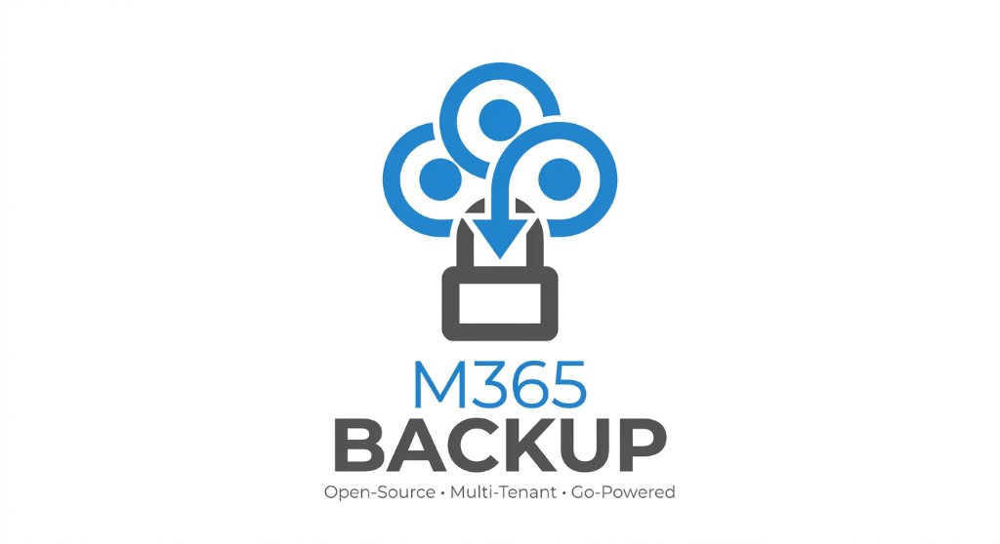
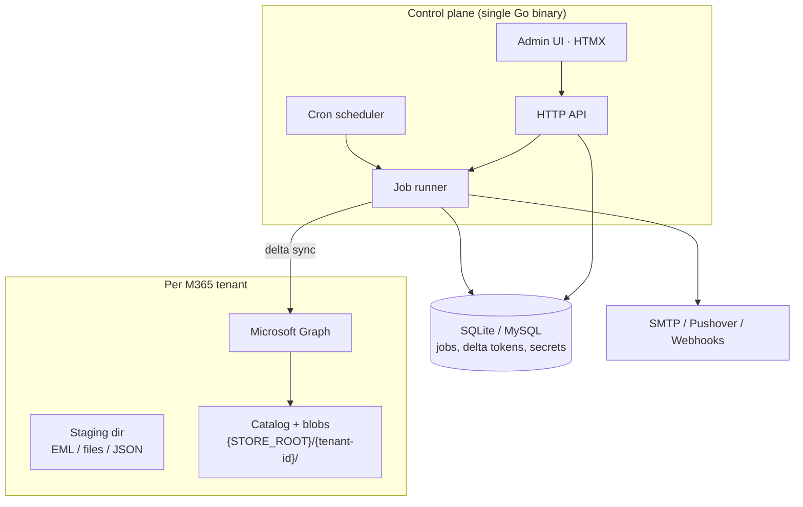

# M365 Backup

<p align="center">
  
</p>

**Open-source multi-tenant Microsoft 365 backup** for self-hosted / data-center operation.

Single Go binary · Graph API delta sync · encrypted snapshots · HTMX admin UI · Apache 2.0

[](LICENSE)
[](https://go.dev/)

---

## Why

After MinIO Community Edition was archived and Corso moved fully commercial, there is no strong open-source **multi-tenant** M365 backup stack for operators who want:

- many customer tenants in one control plane
- incremental Graph sync + storage-level dedup/encryption
- restore without a proprietary backend (repo path + password)
- no vendor lock-in

M365 Backup fills that gap.

## Production use case

We run this stack **on our own infrastructure** (data center / private cloud) as the production Microsoft 365 backup for customer tenants: multi-tenant control plane, encrypted snapshot storage on our disks, Graph delta sync, and restore without a SaaS vendor in the path.

Typical deployment: Debian or Docker Compose + MySQL, bind-mounted snapshot/staging volumes, reverse proxy with TLS, env-based secrets (`MASTER_KEY`, `ADMIN_PASSWORD`, Azure app credentials per tenant).

**Community support:** none guaranteed. The project is open source (Apache 2.0) and provided as-is; operators run, secure, and operate it themselves. Issues/PRs may be reviewed best-effort only.

**Not fully tested.** Coverage is incomplete; expect bugs, edge cases, and breaking changes. Validate restores and monitor jobs before relying on it for critical data.

**Commercial support:** if you need help with deployment, operation, or a production SLA, contact [Reiner IT-Systems](https://www.reiner-itsystems.de/) via the website ([Kontakt](https://www.reiner-itsystems.de/kontakt/)).

## Features

- **Multi-tenant** – manage arbitrary Entra ID / Microsoft 365 tenants
- **Services** – Exchange (EML + delta), OneDrive (delta), Teams / SharePoint (full pull; see [Current status](#current-status-catalog--services)), PST EML-ZIP export
- **Incremental** – Graph delta tokens in SQLite or MySQL + encrypted catalog + CAS blobs per tenant
- **Scheduler** – cron expressions per tenant/service (`robfig/cron`); defaults auto-created; **one active job per service** (different services may run in parallel)

- **Retention** – Smart Recycle (hours/daily/weekly/monthly/yearly) + blob GC
- **Notifications** – SMTP, Pushover, Slack/Teams/generic webhooks (errors, key expiry, restore)
- **Key monitoring** – alert when Azure client secrets approach expiry
- **Admin UI** – HTMX + Go templates embedded in the binary (tenant tabs, live jobs, browser)
- **Direct restore** – ZIP export; Graph upload for OneDrive/SharePoint
- **Docker** – `docker compose` with MySQL and bind-mounted data paths

## Architecture


```mermaid
flowchart TB
  subgraph Control["Control plane (single Go binary)"]
    UI[Admin UI · HTMX]
    API[HTTP API]
    Cron[Cron scheduler]
    Runner[Job runner]
    UI --> API
    Cron --> Runner
    API --> Runner
  end

  subgraph PerTenant["Per M365 tenant"]
    Graph[Microsoft Graph]
    Stage["Staging dir<br/>EML / files / JSON"]
    Store["Catalog + blobs<br/>{STORE_ROOT}/{tenant-id}/"]
    Graph --> Store
  end

  Runner -->|delta sync| Graph
  Runner --> DB[(SQLite / MySQL<br/>jobs, delta tokens, secrets)]
  Runner --> Notify[SMTP / Pushover / Webhooks]
  API --> DB
```

**Data flow:** Scheduler (or UI) enqueues a job → runner pulls changes via Graph delta → writes catalog items + encrypted blobs → commits a generation → updates delta tokens in the DB → optional notification.

Design-Intent & Abläufe (Architektur, Secrets, Jobs, Speicher, UI): **[docs/](docs/README.md)**.  
Kurz zu Katalog / Snapshots / Cron / Service-Lock: [docs/backup-logic.md](docs/backup-logic.md).

**Storage:** item catalog (SQL) + AES-256-GCM content-addressed blobs. Per tenant: `{STORE_ROOT}/{tenant-id}/blobs/` and `manifests/` plus `exports/` for PST runs.

**Smart Recycle:** after each backup, Synology-style retention runs **per service** (hours/daily/weekly/monthly/yearly + keep-min). Expired catalog generations are dropped, then unreferenced blobs are deleted.

**Disaster recovery without this app:** keep each tenant’s store password offline. CLI: [Restore with m365-restore](#restore-with-m365-restore).

## Current status (catalog & services)

Honest snapshot of what works today vs. what is still thin. Treat this as early/open-source software: validate restores before trusting it with critical data.

### Catalog + blobs

| Topic | Status |
|-------|--------|
| Engine | SHA-256 CAS + AES-256-GCM (`internal/blobstore`) and SQL catalog (`internal/catalog`) |
| Layout | Per tenant under `{STORE_ROOT}/{tenant-id}/`: `blobs/`, `manifests/`, `exports/` |
| Snapshots | Catalog generation after each successful backup job (`jobs.snapshot_id` stores the ID) |
| Retention | **Smart Recycle** per service, then blob GC |
| Defaults | 24h / 7d / 4w / 6m / 2y / min 3 snapshots; last 5 PST export runs |
| Offline restore | `m365-restore` with **store path + store password** (export once via UI; not the `MASTER_KEY`) |
| Backends | **Filesystem only** today — no S3 / object backend yet |
| UI password export | After tenant create + Tenant → Einstellungen → **Offline-Recovery** (re-enter admin password → reveal / `.txt` download) |

### Per-service maturity

| Service | Sync model | Snapshot | Restore | Notes |
|---------|------------|----------|---------|-------|
| **Exchange** | Incremental Graph **delta** into catalog (`.eml` blobs) | Yes | ZIP of EMLs | Shared mailboxes supported; first sync can be heavy |
| **OneDrive** | Incremental drive **delta** | Yes | ZIP or Graph upload → `M365Backup-Restore/` | Solid incremental path |
| **Teams** | Full pull + reconcile each run (no real Graph delta) | Yes | ZIP only | Channel messages as `messages.json` + `messages.html`; **attachments not downloaded**; 1:1/group chats not backed up yet |
| **SharePoint** | Full pull + reconcile; **root drive children only** | Yes | ZIP or Graph upload | No deep recursion / real delta yet |
| **PST export** | Reads Exchange catalog → `exports/pst/{run}/` | **No** catalog snapshot (`SkipSnapshot`) | Download ZIPs from UI | ZIP of EML trees — **not** binary Outlook `.pst` (no OSS writer yet) |

Default schedules (after consent): Exchange hourly · OneDrive nightly · Teams nightly · SharePoint weekly · PST weekly but **disabled**.

### Admin UI / ops (working)

- Multi-tenant onboarding + admin consent flow
- UI language: German / English (cookie + `Accept-Language`, switcher in nav)
- Tenant page: quick actions (start backup) + tabs (Jobs, Settings, Statistics, Snapshots, PST exports)
- Job runner with live progress, cancel, logs
- Dateibrowser (service + snapshot version), ZIP restore, OD/SP Graph restore
- Offline store recovery export (password reveal / `.txt` download)
- Notifications: SMTP, Pushover, Slack/Teams/generic webhooks
- Client-secret expiry alerts (warn only — no auto-rotation)
- Disk usage cache (`tenant_usage`, hourly + manual refresh)
- OpenAPI / Swagger at `/openapi`
- Deploy: Docker Compose (MySQL 8.4) or systemd + SQLite/MySQL

### Known gaps

- Calendar / Contacts — permissions documented, **no jobs** yet
- Teams attachments + chats; SharePoint depth/delta
- Binary `.pst` writer
- Offsite / S3 object backend; RBAC, audit log, 2FA, Vault
- Limited automated tests — Graph edge cases and multi-tenant load are under-covered
- Single operator user from env (`ADMIN_USER` / `ADMIN_PASSWORD`); extra API tokens in Settings

See [Roadmap](#roadmap) for planned work.


## Requirements

- Go 1.26+ (build) or a released binary
- Linux recommended (Debian 12/13 for production)
- Disk for tenant stores (e.g. `/var/lib/m365backup` or Apollo mount)
- Azure app registration **per tenant** with application permissions (see below)
- Optional: Docker + MySQL 8.4 via Compose

## Quick start

```bash
git clone <repo-url> m365backup
cd m365backup
cp .env.example .env

# Generate a 32-byte master key (base64) — keep this offline as well
openssl rand -base64 32
# Put the value in .env as MASTER_KEY=...
# Set ADMIN_USER (default m365adminuser) and ADMIN_PASSWORD (8+ chars)

go run ./cmd/server
```

Open http://localhost:8080 and sign in with `ADMIN_USER` / `ADMIN_PASSWORD`. For `/api`, create a Bearer token under Settings.

**Never commit `.env`.** Only `.env.example` (placeholders) belongs in git.

## Docker Compose (MySQL)

Preferred for a quick deploy: app + **MySQL 8.4** (no PostgreSQL). Point host directories at your disks and start.

```bash
cp .env.example .env
# Edit .env — at minimum:
#   MASTER_KEY=$(openssl rand -base64 32)
#   ADMIN_PASSWORD=...
#   MYSQL_PASSWORD=...
#   MYSQL_ROOT_PASSWORD=...
#   DATA_ROOT=/mnt/apollo/m365
#   # DATA_STORE_PATH=/mnt/apollo/m365/store
#   DATA_STAGING_PATH=/mnt/apollo/m365/staging
#   MYSQL_DATA_PATH=/mnt/apollo/m365/mysql
#   PUBLIC_BASE_URL=https://backup.example.com
#   DB_DRIVER is forced to mysql inside compose

docker compose up -d --build
```

| Env var | Purpose | Default |
|---------|---------|---------|
| `DATA_ROOT` | One host dir for store + staging + mysql | `./data` |
| `DATA_STORE_PATH` | Tenant blobs (leave unset to use `$DATA_ROOT/store` or `$DATA_STAGING_PATH/store`) | derived |
| `DATA_STAGING_PATH` | Job temp | `$DATA_ROOT/staging` |
| `MYSQL_DATA_PATH` | MySQL datadir | `$DATA_ROOT/mysql` |
| `HTTP_PUBLISH_PORT` | Published HTTP port | `8080` |

MySQL is **not** published to the host; the app reaches it only as hostname `mysql` on the compose network.

Open http://localhost:8080 (or your `PUBLIC_BASE_URL`).

```bash
docker compose logs -f m365backup
docker compose down
```

SQLite remains the default for bare-metal / `go run` without Docker (`DB_DRIVER=sqlite`).

## Installation

### From source

```bash
go build -o m365backup ./cmd/server
sudo install -m 0755 m365backup /opt/m365backup/m365backup
```

### systemd (Debian)

1. Create user and data dirs:

```bash
sudo useradd --system --home /var/lib/m365backup --shell /usr/sbin/nologin m365backup
sudo mkdir -p /opt/m365backup /etc/m365backup /var/lib/m365backup/{store,staging}
sudo chown -R m365backup:m365backup /var/lib/m365backup
```

2. Create `/etc/m365backup/m365backup.env` from [`.env.example`](.env.example) with real values (mode `0600`).

3. Install the unit from [`deploy/m365backup.service`](deploy/m365backup.service):

```bash
sudo cp deploy/m365backup.service /etc/systemd/system/
sudo systemctl daemon-reload
sudo systemctl enable --now m365backup
```

### Binary releases

Publish artifacts from CI (GitHub/GitLab Releases) and install the same way as “from source”.

## Configuration

| Variable | Required | Default | Description |
|----------|----------|---------|-------------|
| `HTTP_ADDR` | no | `:8080` | Listen address |
| `PUBLIC_BASE_URL` | no | `http://localhost:8080` | Base URL for Azure consent redirect |
| `DB_DRIVER` | no | `sqlite` | `sqlite` or `mysql` |
| `DATABASE_PATH` | sqlite | `./data/m365backup.db` | SQLite file path |
| `MYSQL_HOST` / `PORT` / `USER` / `PASSWORD` / `DATABASE` | mysql | — | MySQL connection (or set `MYSQL_DSN`) |
| `STORE_ROOT` | no | `./data/store` | Per-tenant store root (blobs/manifests/exports) |
| `STAGING_ROOT` | no | `./data/staging` | Temporary backup staging |
| `MASTER_KEY` | **yes** | — | Base64 32-byte AES key |
| `ADMIN_USER` | no | `m365adminuser` | UI login name |
| `ADMIN_PASSWORD` | **yes** | — | UI login password (min 8 chars) |
| `MAX_CONCURRENT_JOBS` | no | `2` | Max parallel jobs **across tenants**. Per tenant+service always ≤1; incrementals wait while a full sync is active (see [docs/backup-logic.md](docs/backup-logic.md)) |
| `SMTP_*` | no | — | Optional env-level SMTP fallback |

Secrets must live in environment / `EnvironmentFile=` only — never in the repository.

## Azure setup

### Automated (recommended)

PowerShell script creates the app registration, Graph **Application** permissions, admin consent, and prints Tenant ID / Client ID / secret:

```powershell
# From a machine with PowerShell 5.1+ or PowerShell 7
cd scripts
.\Register-M365BackupApp.ps1 -RedirectUri "https://<your-host>/api/consent/callback"
```

Fix an existing app (e.g. add missing `Channel.ReadBasic.All`) without rotating the secret:

```powershell
.\Register-M365BackupApp.ps1 -AppId "<application-client-id>"
```

Requires Global Admin (or Application Administrator + Privileged Role Administrator) in the customer tenant. Modules `Microsoft.Graph.Authentication` / `Microsoft.Graph.Applications` are installed automatically if missing.

On Windows Server, RDP, or Windows Terminal, Graph may fail with `A window handle must be configured` (WAM). Re-run with `-UseDeviceCode`, or open a classic `powershell.exe` window from the Start menu (not Windows Terminal / ISE) and run the script there. The script also retries device-code login automatically after that error.

```powershell
.\Register-M365BackupApp.ps1 -RedirectUri "https://<your-host>/api/consent/callback" -UseDeviceCode
```

### Manual permissions

Create **one app registration** (in your ops tenant or the customer tenant) and grant **Application** permissions:

| Permission | Purpose |
|------------|---------|
| `Mail.Read` | Exchange mail |
| `Mail.ReadWrite` | Optional restore |
| `Files.Read.All` | OneDrive / SharePoint |
| `Files.ReadWrite.All` | Optional Graph restore |
| `Team.ReadBasic.All` | List teams (required to enumerate) |
| `Channel.ReadBasic.All` | List channels in a team |
| `ChannelMessage.Read.All` | Teams channel messages |
| `Chat.Read.All` | Teams chats |
| `Sites.Read.All` | SharePoint sites |
| `User.Read.All` | Enumerate users |
| `Application.Read.All` | Secret expiry checks |
| `Calendars.Read` / `Contacts.Read` | Optional (not in MVP jobs) |

### Admin consent flow

1. Add tenant in UI (name, Azure tenant ID, client ID, client secret, optional expiry date) — or paste values from the script output.
2. Click **Admin consent** — redirects to Microsoft (optional if the script already granted app-role consent).
3. Customer admin approves → callback sets status `active` and queues the first Exchange full backup.
4. Other services follow via their default schedules (cron).
5. Re-clicking **Admin consent** on an already active tenant only refreshes Graph permissions — no new jobs.

Redirect URI to register:

```
https://<your-host>/api/consent/callback
```

## API

After login, open **API** in the admin nav or go to `/openapi` for interactive Swagger UI.
The live OpenAPI 3 document is at `/openapi.yaml` (session required); `servers` is set to this instance’s `PUBLIC_BASE_URL`.

## Storage usage (billing)

Disk usage is measured like `du` over the tenant dir (`blobs/` + `manifests/` + `exports/`) and **cached in `tenant_usage`**. A cron runs hourly (`:15`), plus a scan ~45s after startup. The tenants list only reads the cache (so login stays fast).

Refresh from the admin UI (**Speicher aktualisieren**) or:

```http
POST /api/tenants/usage/refresh
POST /api/tenants/{id}/usage/refresh
GET  /api/tenants/{id}/usage          # cached
GET  /api/tenants/{id}/usage?fresh=1  # measure now and store
GET  /api/tenants?usage=1             # list with cached usage
```

## Backup & restore

| Service | Backup format | Restore |
|---------|---------------|---------|
| Exchange | `.eml` blobs in catalog | ZIP download |
| OneDrive | Original files as blobs | ZIP or Graph upload to `M365Backup-Restore/` |
| SharePoint | Site files + `site.json` as catalog items | ZIP or Graph upload |
| Teams | `messages.json` + `messages.html` as catalog items | ZIP archive only |
| PST | EML trees as ZIP under `exports/pst/` (no catalog snap) | Download from UI — not binary `.pst` |

Via the admin UI: open the tenant → **Snapshots** → browse / ZIP download; OneDrive and SharePoint can also push back into Graph (`M365Backup-Restore/`).

For maturity and limitations per service, see [Current status](#current-status-catalog--services).

### Restore with m365-restore

If this app, the DB, or the control plane is gone, you only need:

1. The on-disk store: `{STORE_ROOT}/{tenant-id}/` (`blobs/` + `manifests/`)
2. That tenant’s **store password** — **not** `MASTER_KEY`

**Critical:** the store password is generated at tenant create and stored encrypted in the DB under `MASTER_KEY`. If you never export it, losing the DB (or `MASTER_KEY`) means you **cannot** decrypt blobs. Export it once and keep it offline.

In the admin UI: after creating a tenant you are redirected to **Offline-Recovery**; later via Tenant → **Einstellungen** → *Recovery-Passwort exportieren*.

```bash
go run ./cmd/restore --root /var/lib/m365backup/store/<tenant-id> \
  --password '<STORE_PASSWORD>' --service exchange --generation 1 \
  --out /restore/target
```

PST export runs are **not** catalog snapshots (they live under `{STORE_ROOT}/{tenant-id}/exports/`).

**Not the same as `MASTER_KEY`:** `MASTER_KEY` only unlocks secrets *inside the app DB*. Offline restore needs the per-tenant **store password** from the recovery export.

## Notifications

Configure SMTP, Pushover, or webhook channels under **Settings**, or set `SMTP_*` env vars for a global fallback on `job_error` / key-expiry events.

**Pushover** (like Uptime Kuma): User Key + Application Token, priority (−2…2 Emergency), separate sounds for alert vs OK events, optional device / TTL, and retry/expire for Emergency priority. See [pushover.net/api](https://pushover.net/api).

Events: `job_error`, `job_warning`, `job_success`, `key_expiry_30d`, `key_expiry_7d`, `key_expired`, `quota_warning`, `restore_done`.

## Security

- `MASTER_KEY` encrypts tenant client secrets and store passwords (AES-256-GCM)
- Session cookie auth for the admin UI (username + password); Bearer tokens for `/api`
- Signed, time-limited state for consent callbacks
- See [SECURITY.md](SECURITY.md) for disclosure and “never commit secrets”

## Development

```bash
cp .env.example .env   # fill MASTER_KEY + ADMIN_PASSWORD
make test
make run
```

Layout:

```
cmd/server/          entrypoint
internal/            tenant, backup, storage, notification, db, api, graph, crypto
web/                 templates, static UI, embedded openapi.yaml
deploy/              systemd unit
```

## Roadmap

- Offsite replication, RustFS/S3 object backends
- Teams attachments + chats; deeper SharePoint sync (delta / recursion)
- Binary Outlook `.pst` writer (when a viable OSS path exists)
- RBAC, audit log, 2FA, Vault integration
- Calendar / contacts jobs

(See [Current status](#current-status-catalog--services) for what is already shipped.)

## Contributing

See [CONTRIBUTING.md](CONTRIBUTING.md). Use Conventional Commits. Never commit secrets.

## Support

There is **no free community support** and no guaranteed response to GitHub/GitLab issues. If you deploy this in production, you own day-to-day operations, monitoring, upgrades, and disaster recovery unless you arrange something else.

**Not everything is tested.** The codebase has limited automated coverage and real-world paths (Graph edge cases, restore, retention, multi-tenant load) may contain bugs. Treat it as early/open-source software: verify backups and restores yourself before trusting it with critical data.

If you **want support** (VPS, dedicated servers, consulting, deployment help, managed operation, SLA), get in touch with **Reiner IT-Systems GmbH** on the website:

- https://www.reiner-itsystems.de/
- Kontakt: https://www.reiner-itsystems.de/kontakt/

## License

Copyright 2026 Reiner IT-Systems GmbH

Licensed under the **Apache License, Version 2.0** — see [LICENSE](LICENSE) and [NOTICE](NOTICE).
